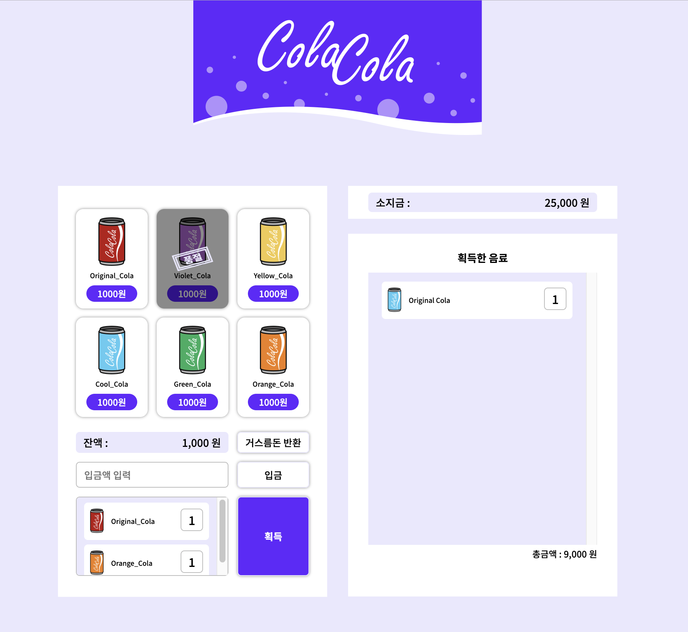

# 멋쟁이 사자처럼 벤딩머신 구현 과제

 

> # 새로운 시도 💡

- grid 적용해보기.
  - 콜라들의 배치는 flex아니면 float로 정리해볼 수 있지 않을 까 했는데, 강사님과 한 라이브 코딩에서 grid를 쓰시는 걸 보고 나도 grid를 적용해봤다. 그리고 콜라들 사이의 마진을 gap으로 조정하는건 신세계였다.. 콜라들 마다 마진을 안줘도 된다니..! 그래도 다음 연습때는 flex랑 float를 한번 써봐야겠다.
- 가상클래스 가상요소에 텍스트 넣기. - 가상요소에는 텍스트를 많이 넣어봤는데, 가상클래스에도 가능한지는 처음 알았다. '품절'을 가상요소로 넣기엔 정보를 가진 텍스트이기 때문에 마크업에 따로 요소로 넣어주는 게 좋겠다는 다른 강사님의 의견이 있었다.

> # 새로 배운 점 💡

- 강사님 코드를 많이 참고하면서 CSS를 작성했는데, IR기법을 위한 속성 값을 잘못 준 것을 못찾아서 나도 어디서 잘못된지 몰라서 CSS전체를 다시 작성할 뻔 했다. 다시 살펴보니, 리셋 CSS에 position: absolute값을 빼먹고 줘서 그런거였다. 텍스트를 띄우지 못해 그대로 자리를 차지해버려서 grid를 썼을 때 이해할 수 없었던 한 줄이 더 생겼었던,,것이다. 급하게 속성을 쓰지 말자!
- float를 해결해줄 수 있는 속성에는 overflow: hidden이나 clear속성만 있는 줄 알았는데, display: inline-block도 플로트된 요소를 인식할 수 있다. 그래서 button 태그안에 작성했던 콜라들은 inline-block요소인 버튼이 플로트된 콜라이미지와 텍스트를 잡을 수 있었던 것이었다. 나는 혼자서 clear속성을 써준 것도 아니고 overflow: hidden;을 준 것도 아닌데 왜 인식하지? 라고 궁금해했다... 이번 일을 계기로 bfc영역을 생성하는 태그, 속성에 대해 다시 공부해봐야겠다고 생각했다!
- 비슷한 모듈은 공통 클래스 네임을 (생각해서) 주도록 하자.   선택된 콜라 리스트트 왼쪽, 오른쪽에 모두 같은 스타일, 디자인으로 들어가있는데, 만든다고 바빴는지, 마크업에 집중하느라 그랬는지 공통 스타일 생각을 못하고 클래스네임을 서로 다르게 줘버렸다. 덕분에 CSS에서 공통 속성값을 두 번이나 적어줬다. 앞으로는 공통 스타일을 가지고 있는 요소들이 무엇인지 먼저 파악해야겠다!

> # 느낀점 💡

- flex, float, grid는 모르고 쓰면 쓸 수도 있겠지만, 잘 쓰려면 각 속성 값을 아주 잘 알고 있어야한다는 걸 느꼈다. 모르고 쓰는 건 안쓰는 것만 못하다!
- HTML 마크업을 끝내고 CSS로 넘어가기 전에 꼼꼼히 클래스 네임을 작성하자. 공통 스타일을 가진 요소는 무엇인지, 어떤 요소를 모듈화해줄 수 있을 것인지 스캔을 잘해야겠다. 그리고 내가 썼지만 그래도 스타일링을 들어가기 전 마크업 구조를 다시 한번 읽어보자. 꼼꼼히 작성한 클래스 네임은 CSS작성 시간을 줄여준다!
- 강사님 코드를 많이 보고 치면서도 이해하고 치는 거랑 이해 못하고 그냥 따라 치는 건 많이 다르다고 느꼈다. 50% 정도는 이해한 것 같으니, 다음 연습때는 80% 이해를 목표로 많이 안보고 칠 수 있도록 해보자.
